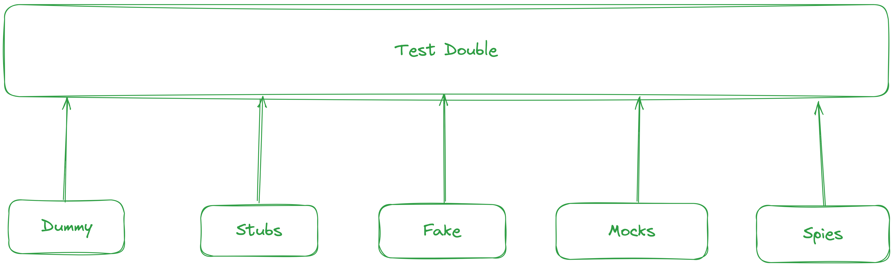

# Test double
- Một "Test Double" là một đối tượng có thể thay mặt cho một đối tượng thực tế trong test.
- Có thể hiểu Test Double giống như 1 interface, trong đó có nhiều kiểu test double (implementation): Dummy, Fake, Stubs, Spies, Mocks


# Dummy
- Một tham số mà không cần test, nhưng vẫn cần truyền vào tham số.
- Thường dùng cho các parameter có kiểu function callback

```typescript
// code.ts
updateCart(items: Item[], fetchDiscount: (items) => {}) {
  this.cart.totalItems += items.length;
  fetchDiscount(this.cart);
}

// code.spec.ts
describe('updateCart', () => {
  const dummy = (items) => ({});

  it('should update cart total', () => {
    component.updateCart(items, dummy);
    expect(component.cart.totalItems).toEqual(4);
  })
})
```

# VD với test thông thường

```typescript
// redis-key.ts
export const getRedisSyncWalletStatusKey = (wallet: string) => {
  return 'syncing_wallet_v2:' + wallet;
};

export const getRedisWalletAddressByUserId = (userId: string) => {
  return `wallet_address_${userId}`;
};

// redis-key.spec.ts
describe('utils / redisKey', () => {
    it('should be pass', () => {
        expect(getRedisSyncWalletStatusKey('wallet')).toBe('syncing_wallet_v2:wallet');
        expect(getRedisWalletAddressByUserId('user_id')).toBe('wallet_address_user_id');
    });
});
```


# Spy

# Reference
- https://viblo.asia/p/xu-ly-phu-thuoc-va-test-double-trong-viec-viet-unit-test-phan-1-naQZRY30Kvx
- https://stackoverflow.com/a/8758060/7228412
- https://martinfowler.com/articles/mocksArentStubs.html#TheDifferenceBetweenMocksAndStubs
- https://jesusvalerareales.com/testing-with-test-doubles/#:~:text=Dummy%3A%20It%20is%20used%20as,how%20it%20will%20be%20used.

# Notes and thought
- Behaviour & state verification
  - Mock = behaviour verification
  - Stub = state verification