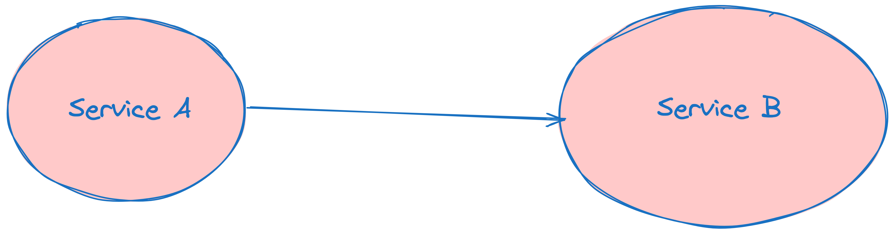

# Giới thiệu
- Phong Do, @minhphong306.
- 2016: MP Telecom - Fullstack developer (Java + AngularJS).
- 2018 ~ 2022: OCG - Backend developer (Golang).
  - Technical leader, moved to Sai Gon.
- 2022: Starbots - Blockchain game on Solana (Typescript).
- 2023: OCG - QE Manager (Playwright, Typescript, Django).
- 2024: Outpost24 - Backend Engineer (Golang, Python, Java).

# Trải nghiệm
## Sập production lần 1
- Do thay đổi thứ tự gRPC
- gRPC lưu trữ theo thứ tự của protobuf
```golang
message Person {
  string name = 1;
  int32 id = 2;
}
```
- Khi đổi thứ tự cần đổi cả 2 service, nếu không sẽ fallback về giá trị default.
- Ví dụ đổi field id lên trước
```golang
message Person {
  int32 id = 1;
  string name = 2;
}
```
- Lúc này nếu service A đã đổi, mà service B không đổi thì B sẽ nhận được giá trị default của kiểu

- Cụ thể là id = 0, name = ""
- Việc này dẫn tới id invalid ~> theo logic unavailable ~> trả về 404.

## Sập production lần 2: Redis keys
[[Redis] ĐỪNG dùng “keys” trên production
](https://minhphong306.wordpress.com/2021/02/04/redis-dung-dung-keys-tren-production/)

## Xoá 16 triệu sản phẩm khách hàng, cấm merge code 2 tuần
- Có 100 cái id của khách nghi ngờ invalid, không có order mà tạo sản phẩm để dùng chùa CDN ảnh.
- Check random 20 cái đầu, không có shop nào có order ~> tin tưởng dữ liệu từ bên devops query.
- Run migration xoá. Đến khi xoá xong, check lại mới thấy cấn, shop đã có 81 order, 16tr700 sản phẩm.

## Giới hạn 50 email đúng ngày release
- Dùng dịch vụ SNS, khi dev dùng sandbox và khoảng 10 email test nên không vấn đề gì.
- Khi lên production test, lúc user không đăng kí được báo lỗi mới tá hoả: SNS production mặc định support 50 email thôi. Muốn thêm thì phải email cho suppor mở ra.
- Hotfix:
  - Email gấp cho AWS support.
  - Code thêm 1 đoạn cho phép user active luôn, không cần vào mail lấy code.
   
## Reach limit của AWS Cognito
- Cũng cùng ngày release phía trên, cognito request limit 120 RPS.
- Ngày đăng kí quá nhiều user ~> reach RPS.
- Hotfix:
  - Thêm layer redis cache 30s. Chấp nhận trong khoảng thời gian ấy có thể có sai số.

## User cheating
- Quá nhiều user  login 1 tài khoảng, cùng 1 lúc.
- Hotfix:
  - Thêm key redis check user đã login hay chưa. Login rồi thì expire session cũ.
  - Query record cũ từ database ra, xử lý tay lại kết quả.
  - Thông báo tới user, ban các tài khoản cheating và đền bù cho user có kết quả bị tụt hạng.